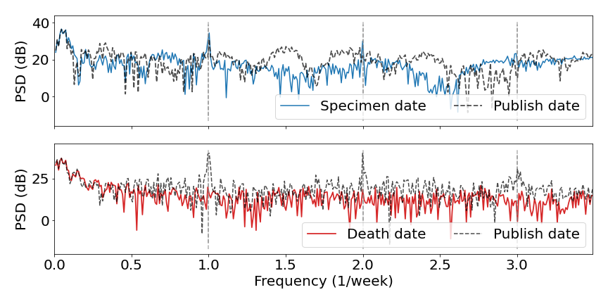

# Periodic Sampling (COVID-19 Data)

This repository explores periodic trends in reported case and death data for multiple diseases. This work supports the paper '_Identification and Attribution of Weekly Periodic Biases in Global Epidemiological Time Series Data_', currently available as a preprint on [medRxiv](https://doi.org/10.1101/2023.06.13.23290903).

We also provide a package for comprehensive [Bayesian Inference](https://en.wikipedia.org/wiki/Bayesian_inference) and [Gibbs Sampling](https://en.wikipedia.org/wiki/Gibbs_sampling) methods to explore this periodic data trends in real or synthetic Covid-19 case data.


## Periodic Data Trends


### Covid-19 Data

We import Covid-19 case and death data from the [John Hopkins Database](https://coronavirus.jhu.edu/about). This data uploaded into separate `.csv` files on a daily basis, and so [routines](periodic_sampling/analysis/country_data.py) in the analysis module are provided to generate location-specific files over the history of the pandemic.

For example:

```python
from analysis import generate_location_df

input_dir = "COVID-19/csse_covid_19_data/csse_covid_19_daily_reports/"
location_key = "England, United Kingdom"

country_df = generate_location_df(input_dir, location_key)
country_df.to_csv("data/England_data.csv")
```

More detailed examples (along with cleaning procedures for the data) are given in [`data_trends.ipynb`](periodic_sampling/data_trends.ipynb).
Currently these procedures are not packaged into a separate method, but this may be updated in the future.

Further information about this data (such as collection methods) can be found in a dedicated [`README`](data/README.md). Pre-generated example data files are also [available](data).

### Other Diseases

We also provide daily case data from the 1918 Spanish Flu and 2022 Haitian Cholera epidemics, in [`other_diseases`](other_diseases/).

### Periodic Reporting Trends

In this data we typically observe a strong oscilatory trend, as depicted in both the cases and death data from England, UK. The raw daily data is given in grey, with a 7-day moving average (typically used in most publications) superimposed in colour.


There are consistent over/under reporting trends on particular weekdays across the duration of the pandemic. These may be quantified through a reporting factor, given by the ratio of observed cases on a given day to the 7-day average about that day. The distribution of reporting factor for each dataset is given below:


A global analysis of these trends is further provided in [`global_pca.ipynb`](periodic_sampling/global_pca.ipynb).

### Origin of Bias

We further use a dataset from PHE that distinguishes between the true date of death, and the date the death has been attributed to on online reporting systems. From analysis in [`periodicity_analysis.ipynb`](UK_raw_data/periodicity_analysis.ipynb), we identify a weekly oscillation in the death data grouped by reporting date that is not present in the true event date, suggesting that this weekly trend is fully attributable to biases in the reporting process.




## $R_{t}$ Inference

### Synthetic Data

To benchmark inference approaches with a known ground truth, we generate synthetic pandemic data using a [renewal model framework](periodic_sampling/synthetic_data/renewal_model.py). Alongside this are provided various [reporter functions](periodic_sampling/synthetic_data/biased_reporter.py), which can return/save this data in `.csv` format, as well as applying various reporting biases to replicate the trends described above.

An example of this process is given below:

```python
from synthetic_data import RenewalModel, Reporter

model = RenewalModel(R0=0.99)
model.simulate(T=200, N_0=500)

rep = Reporter(model.case_data)
truth_df = rep.unbiased_report()
bias_df = rep.fixed_bias_report(bias = [0.5, 1.4, 1.2, 1.1, 1.1, 1.1, 0.6],
                                multinomial_dist=True)
```

This would generate the following data:


All functions have complete docstrings to record their functionality and expected arguments. Further detail is also given in the [README](periodic_sampling/README.md) for the [`periodic_sampling`](periodic_sampling) module.

### Inference Methods

Both Metropolis-Hastings and Gibbs sampling methods are implemented for use in Bayesian inference. These have separate parameter and sampling classes, but a combined (_'mixed'_) sampling method is also implemented to allow inference on multiple parameters of different types. We also utilise independent sampling for the discrete case values in inference of the ground truth time series.

This flexible implementation is applicable to a wide range of problems, with some examples from Ben Lambert's "[A Student's Guide to Bayesian Statistics](https://study.sagepub.com/lambert)" given in [`exampler.ipynb`](periodic_sampling/sampling_methods/exampler.ipynb). These methods are then applied to the inference of the true time series from the biased time series, under various assumptions described in a separate [`README`](periodic_sampling/README.md).

We also introduce a number of [methods](stan_inference/) in [Stan](https://mc-stan.org/) using a [No U-Turn Sampler](https://arxiv.org/abs/1111.4246), to handle larger populations without the computational limits we have imposed on our mixed sampler through the use of independent sampling on the time series. An example of predictions for the timeseries and reproduction number profile (based on the posterior mean) is given below:
